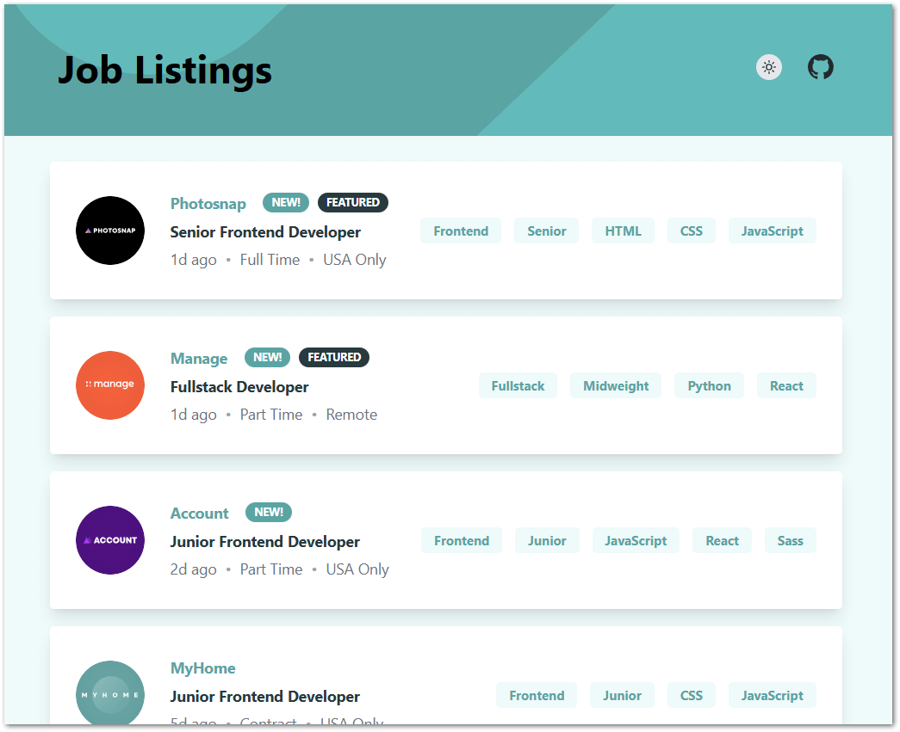

# Frontend Mentor - Job listings with filtering solution

This is a solution to the [Job listings with filtering challenge on Frontend Mentor](https://www.frontendmentor.io/challenges/job-listings-with-filtering-ivstIPCt).

## Table of contents

- [Frontend Mentor - Job listings with filtering solution](#frontend-mentor---job-listings-with-filtering-solution)
  - [Table of contents](#table-of-contents)
  - [Overview](#overview)
    - [The challenge](#the-challenge)
    - [Screenshot](#screenshot)
    - [Links](#links)
  - [My process](#my-process)
    - [Built with](#built-with)
  - [Author: Joel Byrd](#author-joel-byrd)

## Overview

### The challenge

Users should be able to:

- View the optimal layout for the site depending on their device's screen size
- See hover states for all interactive elements on the page
- Filter job listings based on the categories

### Screenshot

### Links

- Solution URL: [https://joelbyrd.github.io/job-listings/](https://joelbyrd.github.io/job-listings/)
- Live Site URL: [https://github.com/joelbyrd/job-listings](https://github.com/joelbyrd/job-listings)

## My process

### Built with

- [React (18.3)](https://reactjs.org/) - JS library  
  React is a solid tool for building frontend apps -- it's modern, mature, and powerful. With components, reducers, and state, it lets you create scalable UIs that don't fall apart the moment someone clicks something weird.

- [TypeScript](https://www.typescriptlang.org/) - Strongly-typed JavaScript  
  TypeScript is like JavaScript with a safety net. Because it is strongly-typed JavaScript, it makes sure you don't accidentally pass a banana where the code expects a car. No more guessing what your data should look like -- TypeScript keeps it clean and sane.

- [Tailwind CSS](https://tailwindcss.com/) - For styles  
  Tailwind CSS is a developer's best friend when it comes to styling. It's like playing with LEGO bricks -- quick to build and easy to customize. Plus, it pairs beautifully with a component-based architecture like React, making styling reusable and predictable.

- [Vite](https://vite.dev/) - Frontend build tool  
  Vite is like Webpack's cool younger sibling -- super fast and doesn't need a ton of babysitting. It gets out of your way, so you can focus on building instead of waiting for the dev server to restart.

- [Vitest](https://vitest.dev/) - Testing framework  
  Vitest is Jest, but with a caffeine boost. Since I was already using Vite, Vitest was a no-brainer -- same familiar syntax, faster performance, and no “config rage.” It's simple, fast, and doesn't make testing feel like a chore.

- **Mobile-first design**  
  The app is designed with a mobile-first approach to ensure it looks great and works smoothly on all devices. It includes a sticky filter bar, making it easy to filter job listings as you scroll.

- **Light/Dark modes**  
  I implemented light and dark modes to enhance accessibility and user experience. It defaults to the user's system settings, respecting their preferences for brightness and contrast.

## Author: Joel Byrd

- [LinkedIn](https://www.linkedin.com/in/joelbyrd/)
- [X (formerly Twitter) - @joelmarkbyrd](https://x.com/joelmarkbyrd)
